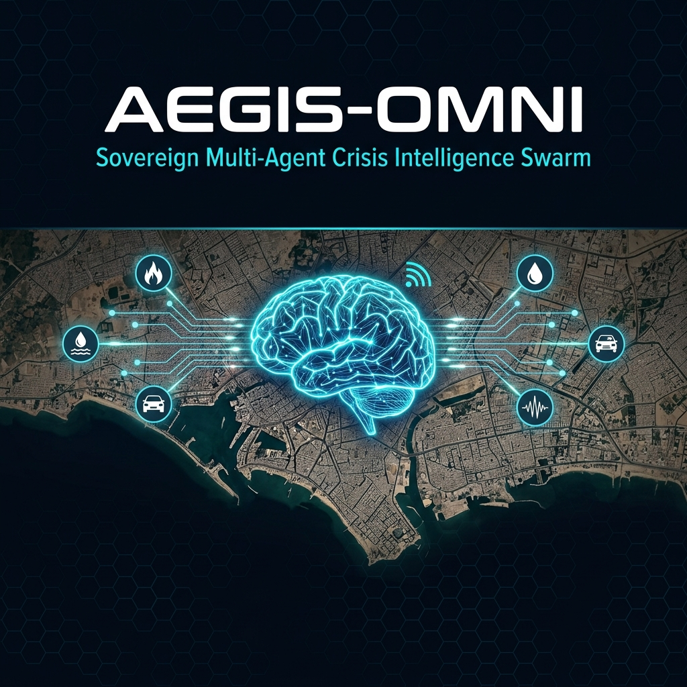

# Aegis-Omni: The Omni-Crisis Intelligence Swarm



> **"A sovereign, multi-agent AI swarm designed for metropolitan-scale predictive defense, real-time telemetry fusion, and zero-trust event validation."**

---

## 🏗️ Architecture Flow & System Topology

> *System Topology Diagram Placeholder*
>
> **Data Ingestion & Routing:** The system operates on a decentralized architecture. Edge devices (Mobile Citizen Sentinel) and simulation telemetry endpoints continuously stream multimodal data (noisy text, spatial telemetry, sensor data) into a local FastAPI Gateway.
>
> **Swarm Orchestration:** A stateful LangGraph Orchestrator intercepts this data and routes signals chronologically to specialized modular LLM agents (DataFuser, TriageAgent, ValidationSentinel, CascadePredictor, ResourceAllocator).
>
> **Sovereign Execution:** All reasoning, decision-making, and simulation execution occur entirely within a localized, zero-trust environment. A headless GPU server processes agentic tasks while the Flutter-based Tactical Web Command Center displays live intelligence mapping.

---

## ⚡ Key Capabilities

*   **Multi-Source Signal Fusion**: Ingests and normalizes noisy citizen reports alongside rigid physical sensor telemetry (e.g., weather, traffic).
*   **Zero-Trust Verification Engine**: Employs autonomous, multi-agent corroboration to catch and eliminate false alarms (e.g., identifying when social hysteria contradicts physical weather telemetry).
*   **Parallel Agentic Triage**: Real-time classification of crisis severity and affected populations using specialized inference agents.
*   **Autonomous Resource Orchestration**: Dynamically models emergency routes and maps specific municipal resources (e.g., dewatering pumps, heavy repair squads) to verified incidents.
*   **Action Simulation Pipeline**: High-fidelity execution simulator that triggers localized tickets and instantly alerts edge nodes via websocket/terminal feeds.

---

## 🛠️ Technical Stack Split

*   **AI Orchestration & Agentic Logic**: LangGraph, Modular Agent Nodes (Python)
*   **LLM Integration**: Google Gemini / Llama-3-70B Pipeline
*   **Backend & Gateway**: Python 3.10+, FastAPI
*   **Simulation Engine**: Custom High-Frequency Telemetry Injector
*   **Frontend Command Center**: Flutter (Web Dashboard & Mobile Node)
*   **Infrastructure**: Docker, Local-First Sovereign Networking

---

## 📊 Proof of Evaluation

> *Metrics & Telemetry Data Placeholder*
>
> *   **RAGAS Evaluation Score**: `[Insert Metric]`
> *   **Latency Metrics**: Average inference and end-to-end swarm consensus time `< [X] ms` on local headless hardware.
> *   **Token Consumption Efficiency**: `[Insert tokens/request efficiency data]`
> *   **Validation Accuracy**: `[X]%` reduction in false positives via the Zero-Trust Sentinel agent.

---

## 🚀 Quick Start & Local Deployment

Initialize the entire sovereign multi-agent swarm locally using Docker for an immediate, isolated environment.

```bash
# Clone the repository
git clone https://github.com/[your-username]/Aegis-Omni.git
cd Aegis-Omni-Master

# Build and deploy the sovereign container architecture
docker-compose up --build
```

### Manual Local Execution

If deploying directly to a localized machine without Docker:

```bash
# 1. Navigate to Swarm Core
cd Aegis-Omni-Master/backend_swarm

# 2. Virtual Environment Setup
python -m venv venv
source venv/bin/activate  # On Windows: `venv\Scripts\activate`

# 3. Package Installation
pip install -r requirements.txt

# 4. Terminal 1 — Start the Swarm API Gateway
python main_api.py

# 5. Terminal 2 — Fire Action Simulation (Telemetry Injection)
python simulate_citizen_report.py
```

*Note: For the Tactical Dashboard and Mobile Node, navigate to `frontend_admin` and `frontend_mobile` respectively and run `flutter run`.*

---

## 🛑 Error Handling & Edge Cases

*   **API Endpoint Unreachable / Timeout**: If the primary LLM inference pipeline experiences a network timeout, HTTP 429 rate limit, or 503 error, a localized, deterministic circuit breaker (fallback logic) automatically engages to prevent system lockup and ensure continuous emergency response.
*   **Sensor Discrepancy & Zero-Trust Rejection**: The swarm is designed to handle contradictory inputs gracefully. If a severe event is reported via social channels but physical telemetry reads zero anomalies (e.g., flash flood reported with `0.0mm` rain), the Validation Sentinel agent will override the alert, flag it as a false positive, and halt resource allocation.
*   **Local Server Drop**: The stateful LangGraph orchestrator maintains the crisis event loop. Should a node disconnect, the state is preserved locally, allowing the system to resume assessment and allocation upon restoration.

---
*Aegis-Omni Intelligence Command · Sovereign Architecture*
