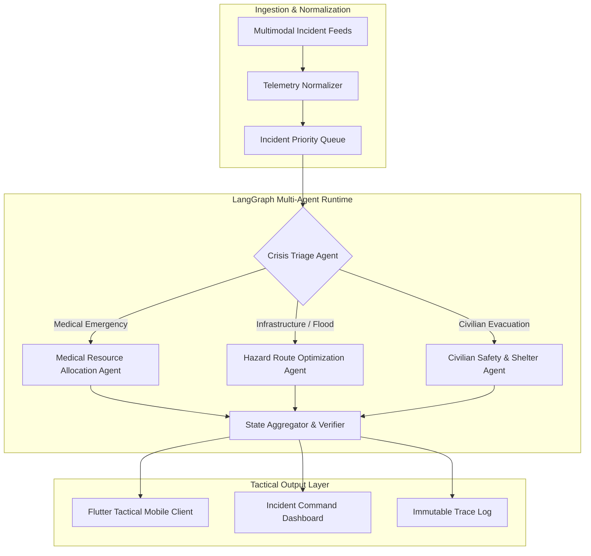

# Aegis-AI: Sovereign Multi-Agent Crisis Intelligence Swarm

> Autonomous multi-agent coordination swarm designed for urban crisis triage, real-time resource routing, and edge communications across partitioned networks.

[](LICENSE)
[](https://www.python.org/)
[](https://flutter.dev/)
[](https://github.com/langchain-ai/langgraph)
[](https://huggingface.co/meta-llama/Meta-Llama-3-70B)

---

## Overview

During large-scale urban emergencies—such as severe flooding, seismic events, or localized grid blackouts—centralized emergency management centers face two critical points of failure: **severe communication bottlenecks** and **high cognitive load on human dispatchers**. 

**Aegis-AI** addresses these limitations by providing a decentralized, multi-agent intelligence runtime. It ingests heterogeneous incident feeds (sensor telemetry, civilian voice/text reports, field status logs), constructs an evolving topological crisis graph, and routes actionable response plans directly to tactical mobile clients operated by first responders.

---

## Problem

- **Decision Latency**: Traditional manual dispatch takes 15–45 minutes to cross-verify multi-agency reports during high-entropy events.
- **Network Partitioning**: Field teams frequently lose persistent broadband connectivity, rendering cloud-dependent emergency portals inaccessible.
- **Conflicting Telemetry**: Disaster reports frequently contain duplicate or conflicting incident reports from civilians.

---

## Solution & Architectural Workflow

Aegis-AI models the crisis response lifecycle as a stateful directed acyclic graph (DAG) using **LangGraph**. Individual specialized agent nodes evaluate incident severity, verify geographic constraints, calculate evacuation routes, and synthesize tactical dispatches.



---

## Core Components

1. **Crisis Triage Node (`src/agents/assessment/`)**: Extracts severity metrics, casualty estimates, and required agency capabilities from raw unstructured reports using Llama-3-70B.
2. **Hazard Routing Engine (`src/agents/routing/`)**: Graph-based pathfinding dynamically avoiding reported road collapses, flooding vectors, and electrical hazards.
3. **State Engine (`src/core/state.py`)**: Manages persistent conversation state, agent scratchpads, and execution checkpoints using LangGraph state graphs.
4. **Tactical Mobile Client (`Aegis-Omni-Master/`)**: Offline-capable Flutter application caching local sector maps and displaying prioritized task checklists for first responders.

---

## Technology Stack

- **Agent Runtime**: Python 3.11+, LangGraph, LangChain, Poetry
- **LLM Foundation**: Meta Llama-3-70B (Hugging Face Inference API / Local Ollama instance)
- **Mobile Client**: Flutter 3.x, Dart, Provider state management
- **Testing & Quality**: Pytest, Pre-commit hooks, Flake8 linting

---

## Repository Structure

```
.
├── src/
│   ├── agents/               # Specialized triage and routing agent definitions
│   ├── core/                 # LangGraph state machines and configuration
│   ├── schemas/              # Pydantic data contracts for incidents and telemetry
│   └── utils/                # Geocoding helpers and trace logging
├── Aegis-Omni-Master/        # Tactical Flutter mobile application codebase
├── config/                   # Prompts, agent system instructions, and schemas
├── tests/                    # Unit and graph execution test suite
├── Antigravity_prompts_usage.mp4  # Execution demonstration video
├── pyproject.toml            # Poetry project dependencies and build configuration
└── pytest.ini                # Pytest runtime configuration
```

---

## Getting Started

### Prerequisites
- Python 3.11 or higher
- [Poetry](https://python-poetry.org/) package manager
- Flutter SDK (optional, for mobile client compilation)

### Installation
```bash
# Clone the repository
git clone https://github.com/HamzaKhanBUIC/Aegis-AI-The-Omni_Crisis-Intelligence-Swarm.git
cd Aegis-AI-The-Omni_Crisis-Intelligence-Swarm

# Install dependencies via Poetry
poetry install

# Set up environment configuration
cp .env.example .env
```

### Configuration
Edit `.env` to configure your LLM endpoint:
```env
HUGGINGFACE_API_KEY=your_api_key_here
LLM_MODEL_NAME=meta-llama/Meta-Llama-3-70B-Instruct
ENVIRONMENT=development
LOG_LEVEL=INFO
```

### Running the Test Suite
```bash
# Execute unit tests and agent state transitions
poetry run pytest tests/ -v
```

---

## Security & Reliability Considerations

- **Graceful Fallback**: If remote LLM endpoints become unreachable, agents automatically fall back to deterministic regex and rule-based heuristic routing.
- **Audit Trails**: Every agent decision and state modification is serialized to an append-only JSON log file for post-incident retrospective analysis.
- **No Hardcoded Credentials**: API tokens and service endpoints are strictly injected via environment variables.

---

## Limitations & Current Status

- **Edge Deployment**: While the Flutter client runs offline, local LLM execution requires at least 16GB of unified memory or a dedicated edge accelerator.
- **Network Sync**: Peer-to-peer mesh synchronization between mobile clients currently requires a local Wi-Fi / ad-hoc network connection.

---

## License

This project is licensed under the MIT License - see the [LICENSE](LICENSE) file for details.
